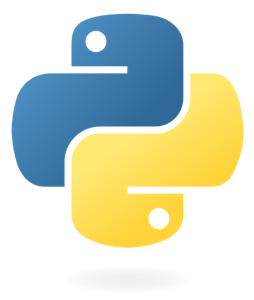
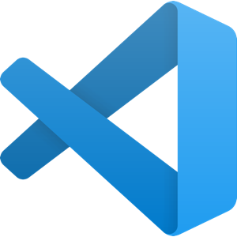
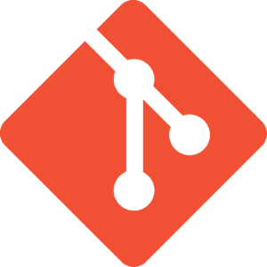
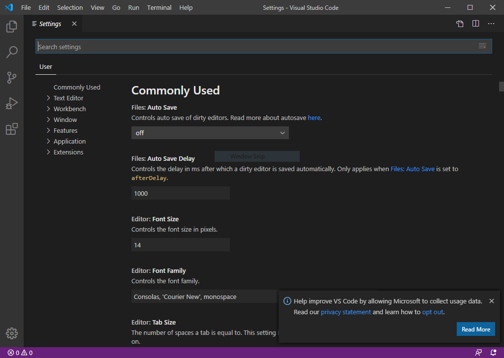
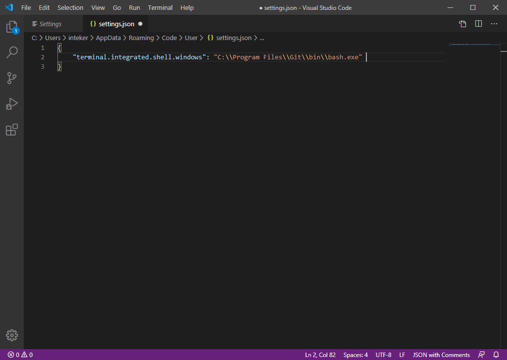
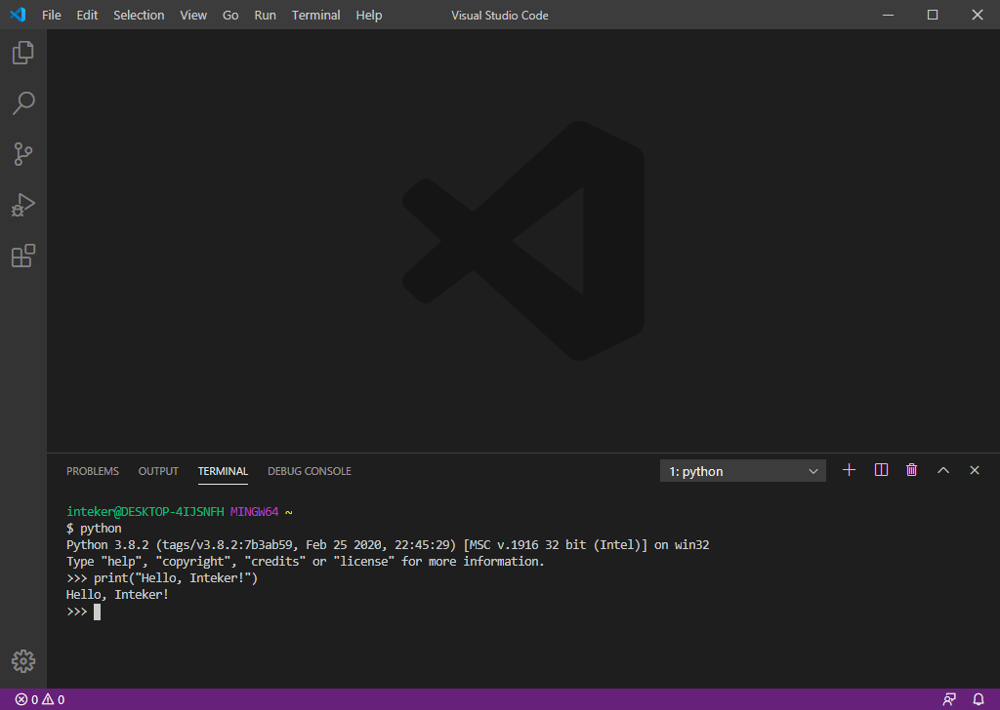

# Medkit for Windowsers

At Open Institute of Technology, we strongly believe that serious professional software developers need to know [Unix](https://en.wikipedia.org/wiki/Unix-like). The fact is that a vast [majority of servers on the Internet](https://en.wikipedia.org/wiki/Usage_share_of_operating_systems#Public_servers_on_the_Internet) are powered by Unix systems. Therefore, at Open Institute of Technology, we train our students on [Linux](https://en.wikipedia.org/wiki/Linux), an open source Unix-like operating system.

However, Microsoft Windows is [still majorly used by end-users](https://insights.stackoverflow.com/survey/2019#technology-_-developers-primary-operating-systems), especially by video gamers, as Windows [PC machines](https://en.wikipedia.org/wiki/Personal_computer) are more affordable than Apple Mac computers, and are more user-friendly than Linux for IT newbies:

|          | 2018  | 2019  |
| -------- | ----- | ----- |
| Windows  | 49.4% | 45.3% |
| MacOS    | 27.4% | 29.2% |
| Linux    | 23.0% | 25.3  |
| BSD/Unix | 0.2%  | 0.1%  |

So, you have a Windows machine? You are wondering how you can follow our curriculum? No problem. We [leave no man behind](https://www.youtube.com/watch?v=V-luZXfkZ9k)! We have a [medkit for you](https://www.youtube.com/watch?v=RAK7Yaa5Dg8). :)

## Installation

To follow our curriculum, you will need to install the following applications on your computer:

| Application                      | Description                                                                                                                                                                                                                                                                                                                                                                                                                                             | Installation Note                                                                                                                              |
| -------------------------------- | ------------------------------------------------------------------------------------------------------------------------------------------------------------------------------------------------------------------------------------------------------------------------------------------------------------------------------------------------------------------------------------------------------------------------------------------------------- | ---------------------------------------------------------------------------------------------------------------------------------------------- |
|              | [Python](https://www.python.org/) is a general-purpose programming language quite easy to learn and to develop softwares with. At Open Institute of Technology, you will learn to master Python, among some other programming languages.                                                                                                                                                                                                                | [Install](https://www.python.org/downloads/) the [most recent version of Python](https://www.youtube.com/watch?v=4Rx_JRkwAjY).                 |
|  | [Visual Studio Code](https://code.visualstudio.com/) is a source-code editor developed by Microsoft for Windows, Linux and macOS. It includes syntax highlighting, intelligent code completion, code refactoring, and support for debugging. All what you need to learn how to code!                                                                                                                                                                    | [Install](https://code.visualstudio.com/download) the most recent version of [Visual Studio Code](https://www.youtube.com/watch?v=VqCgcpAypFQ) |
|                 | [Git](https://git-scm.com/) is a [distributed version-control system](https://en.wikipedia.org/wiki/Distributed_version_control) for tracking changes in source code during software development. Git is the [overwhelming favorite](https://web.archive.org/web/20190530142357/https://insights.stackoverflow.com/survey/2018/#work-_-version-control) of worldwide developers. At Open Institute of Technology, you are going to use Git since day 1! | [Install](https://git-scm.com/downloads) the [most recent version of Git](https://www.youtube.com/watch?v=nbFwejIsHlY).                        |

## Configuration

Once you have installed these three applications, you need to configure Visual Studio Code to integrate Git Bash.

Run Visual Studio Code and follow the procedure below:

1. Press `Ctrl` and `,` (comma) on your keyboard to open the `Settings`

2. In the edit field `Search settings`, enter the keywords `terminal default shell windows`

3. In the section `Terminal > Integrated > Shell: Windows`, click on the link `Edit in settings.json`

4. Enter the value `C:\\Program Files\\Git\bin\\bash.exe` for the key `terminal.integrated.shell.windows`

5. Press `Ctrl` and `S` to save your modification

6. Close the tabs `settings.json` and `Settings`

You can now to open the Git Bash in the Visual Studio Code terminal. Simply press `Ctrl` and `` ` `` (backquote/backtick):

Now you are all set up! You can go on duty!

