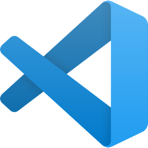
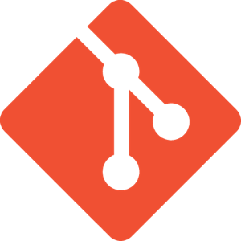
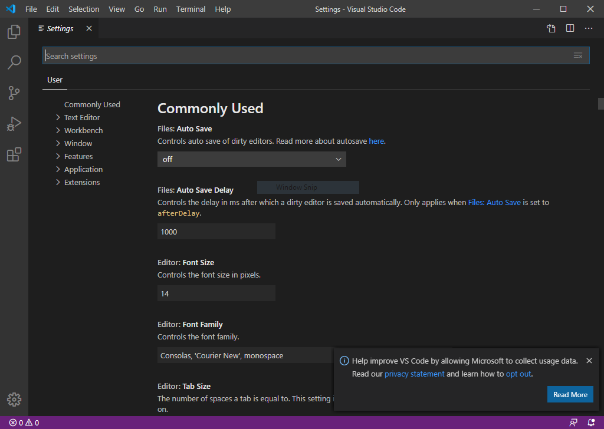

# Medkit dành cho người dùng Windows

Open Institute of Technology luôn tin rằng những lập trình viên nghiêm túc và chuyên nghiệp cần phải biết [Unix](https://en.wikipedia.org/wiki/Unix-like). Thực tế là [phần lớn các máy chủ servers trên mạng internet](https://en.wikipedia.org/wiki/Usage_share_of_operating_systems#Public_servers_on_the_Internet) đều chạy trên các hệ Unix. Vì thế, tại Open Institute of Technology, bạn sẽ được học trên nền [Linux](https://en.wikipedia.org/wiki/Linux), một hệ điều hành máy tính mã nguồn mở.

Tuy nhiên, Microsoft Windows vẫn còn [được nhiều người dùng cuối sử dụng](https://insights.stackoverflow.com/survey/2019#technology-_-developers-primary-operating-systems), nhất là các game thủ, vì các [máy tính cá nhân](https://en.wikipedia.org/wiki/Personal_computer) hệ Windows rẻ hơn máy Apple Mac, và vì Windows thân thiện với người mới biết IT hơn so với Linux:

|          | 2018  | 2019  |
| -------- | ----- | ----- |
| Windows  | 49.4% | 45.3% |
| MacOS    | 27.4% | 29.2% |
| Linux    | 23.0% | 25.3  |
| BSD/Unix | 0.2%  | 0.1%  |

Bạn đang dùng một máy tính hệ Windows? Bạn đang tự hỏi vậy làm thế nào để học chương trình của Open Institute of Technology? Không vấn đề gì. Open Institute of Technology [không bỏ rơi ai cả](https://www.youtube.com/watch?v=V-luZXfkZ9k)! Chúng tôi có [medkit cho bạn](https://www.youtube.com/watch?v=RAK7Yaa5Dg8). :)

## Cài đặt

Để có thể theo các khóa học của Open Institute of Technology, bạn cần cài các chương trình sau vào máy tính:

| Chương trình                     | Mô tả                                                                                                                                                                                                                                                                                                                                                                                                                                                                                        | Lưu ý khi cài đặt                                                                                                                              |
| -------------------------------- | -------------------------------------------------------------------------------------------------------------------------------------------------------------------------------------------------------------------------------------------------------------------------------------------------------------------------------------------------------------------------------------------------------------------------------------------------------------------------------------------- | ---------------------------------------------------------------------------------------------------------------------------------------------- |
|              | [Python](https://www.python.org/) là một ngôn ngữ lập trình đa ứng dụng khá dễ học và dễ dùng để phát triển phần mềm. Tại Open Institute of Technology, bạn sẽ học cách dùng Python sao cho thuần thục, cùng với một số ngôn ngữ lập trình khác.                                                                                                                                                                                                                                             | Nhớ [cài đặt](https://www.python.org/downloads/) [phiên bản Python mới nhất](https://www.youtube.com/watch?v=4Rx_JRkwAjY).                     |
|  | [Visual Studio Code](https://code.visualstudio.com/) là một trình soạn thảo source-code dành cho Windows, Linux và MacOS được phát triển bởi Microsoft. Trình này hỗ trợ làm nổi (highlight) các cú pháp lệnh (syntax), gợi ý hoàn thiện code (code completion), cải tiến (refactor) code, và tìm lỗi (debug). Nói chung, hỗ trợ mọi thứ bạn cần để học code!                                                                                                                                | Nhớ [cài đặt](https://code.visualstudio.com/download) phiên bản mới nhất của [Visual Studio Code](https://www.youtube.com/watch?v=VqCgcpAypFQ) |
|                 | [Git](https://git-scm.com/) là một [hệ thống quản lý phiên bản phần mềm phân tán](https://en.wikipedia.org/wiki/Distributed_version_control) dùng để theo dõi các thay đổi của mã nguồn trong quá trình phát triển phần mềm. Git [rất được ưa chuộng](https://web.archive.org/web/20190530142357/https://insights.stackoverflow.com/survey/2018/#work-_-version-control) bởi các lập trình viên trên khắp thế giới. Tại Open Institute of Technology, bạn sẽ dùng Git ngay từ ngày đầu tiên! | Nhớ [cài đặt](https://git-scm.com/downloads) [phiên bản Git mới nhất](https://www.youtube.com/watch?v=nbFwejIsHlY).                            |

## Thiết lập

Sau khi đã cài đặt 03 ứng dụng trên, bạn cần thiết lập cho Visual Studio Code mở được Git Bash .

Hãy chạy Visual Studio Code và làm theo hướng dẫn sau:

1. Nhấn tổ hợp phím `Ctrl` và `,` (dấu phẩy) để mở `Settings`

2. Trong ô `Search settings`, gõ từ khóa `terminal default shell windows`
3. Trong phần `Terminal > Integrated > Shell: Windows`, nhấp chọn `Edit in settings.json`

4. Gõ giá trị `C:\\Program Files\\Git\bin\\bash.exe` vào cho `terminal.integrated.shell.windows`

5. Nhấn tổ hợp phím `Ctrl` và `S` để lưu thay đổi
6. Đóng các tabs `settings.json` và `Settings`

Giờ bạn đã có thể mở Git Bash trong terminal của Visual Studio Code. Chỉ cần nhấn tổ hợp phím `Ctrl` và `` ` `` (dấu backquote/backtick):

Bạn đã chuẩn bị xong rồi đấy! Đi làm nhiệm vụ thôi!

